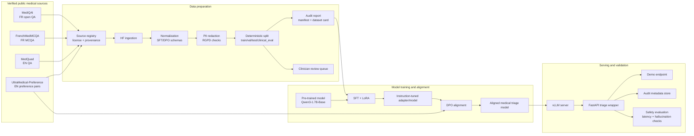

# Architecture

This POC separates data preparation, training/alignment, and serving so each phase can be
audited independently.

```mermaid
flowchart LR
    subgraph Sources["Verified public medical sources"]
        A1["MediQAl<br/>FR open QA"]
        A2["FrenchMedMCQA<br/>FR MCQA"]
        A3["MedQuad<br/>EN QA"]
        A4["UltraMedical-Preference<br/>EN preference pairs"]
    end

    subgraph DataPrep["Data preparation"]
        B1["Source registry<br/>license + provenance"]
        B2["HF ingestion"]
        B3["Normalization<br/>SFT/DPO schemas"]
        B4["PII redaction<br/>RGPD checks"]
        B5["Deterministic split<br/>train/val/test/clinical_eval"]
        B6["Audit report<br/>manifest + dataset card"]
        B7["Clinician review queue"]
    end

    subgraph Training["Model training and alignment"]
        C1["Pre-trained model<br/>Qwen3-1.7B-Base"]
        C2["SFT + LoRA"]
        C3["Instruction-tuned adapter/model"]
        C4["DPO alignment"]
        C5["Aligned medical triage model"]
    end

    subgraph Serving["Serving and validation"]
        D1["vLLM server"]
        D2["FastAPI triage wrapper"]
        D3["Audit metadata store"]
        D4["Safety evaluation<br/>latency + hallucination checks"]
        D5["Demo endpoint"]
    end

    A1 --> B1
    A2 --> B1
    A3 --> B1
    A4 --> B1
    B1 --> B2 --> B3 --> B4 --> B5 --> B6
    B5 --> B7
    B6 --> C2
    A4 --> C4
    C1 --> C2 --> C3 --> C4 --> C5
    C5 --> D1 --> D2 --> D5
    D2 --> D3
    D2 --> D4
```
